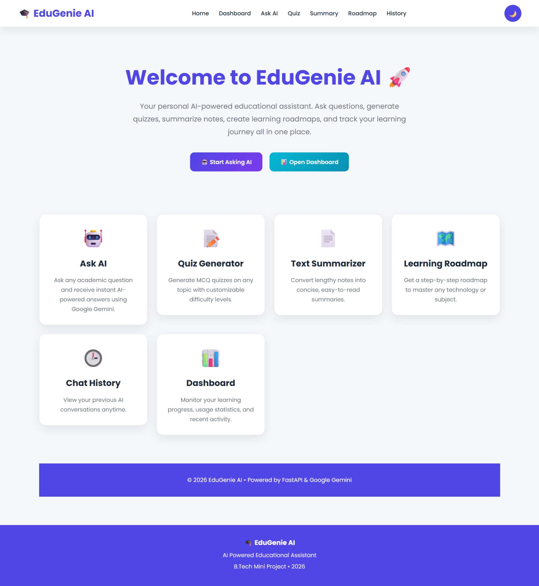
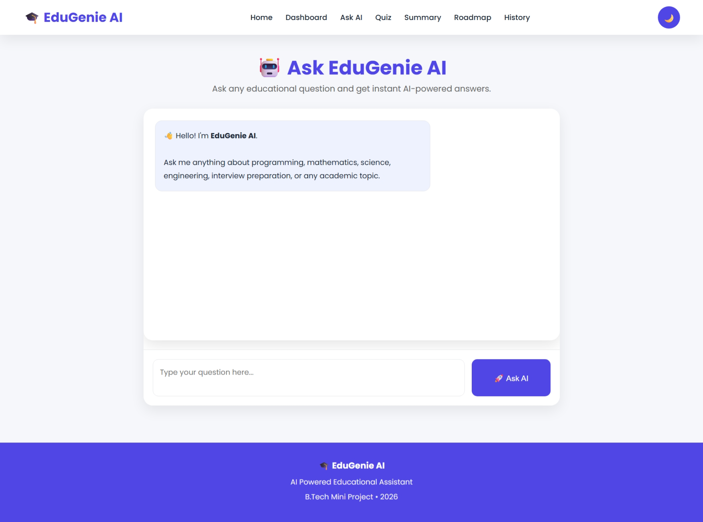
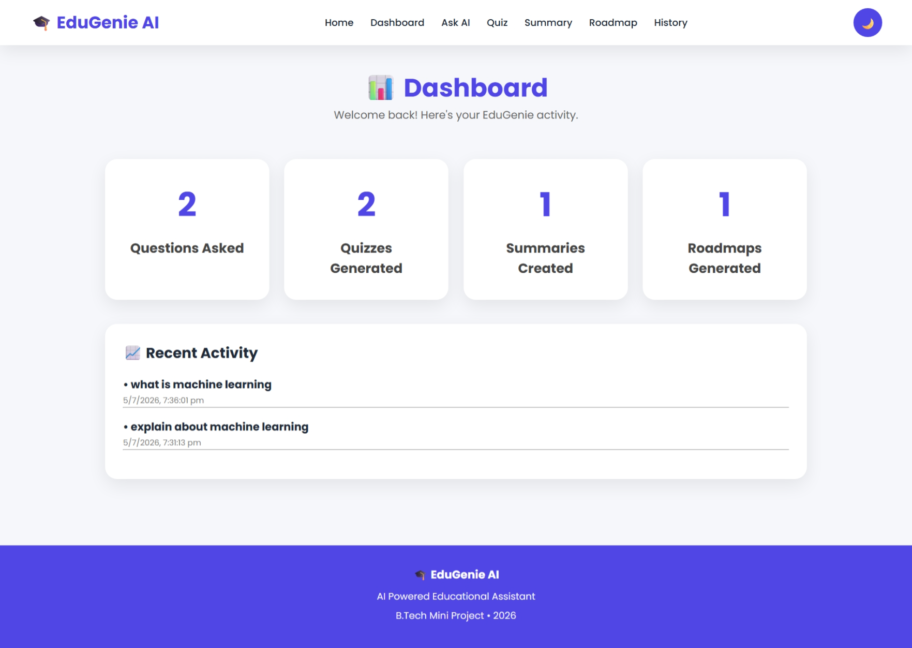
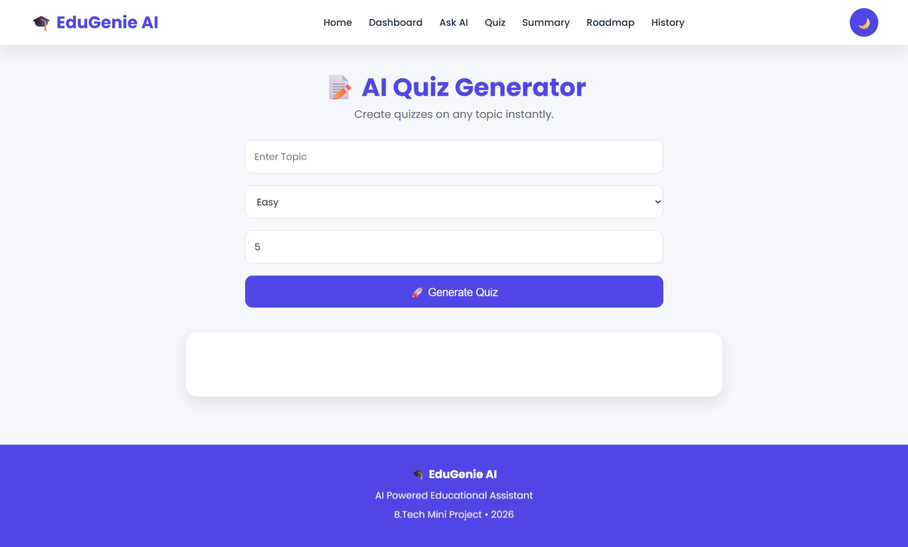
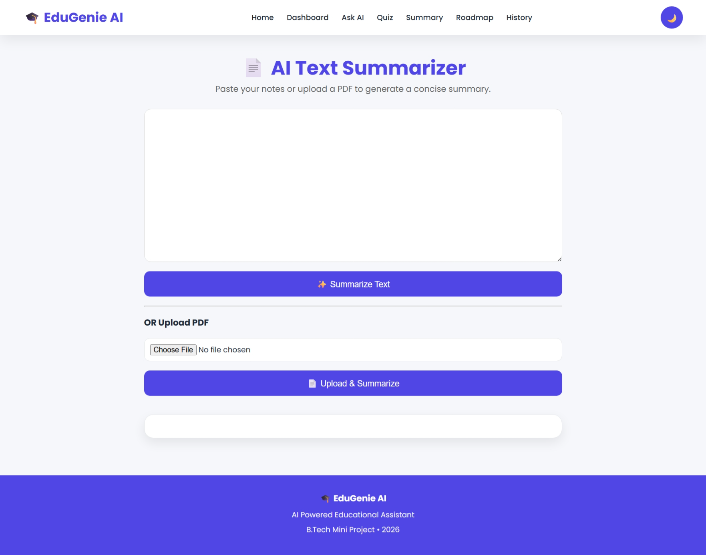
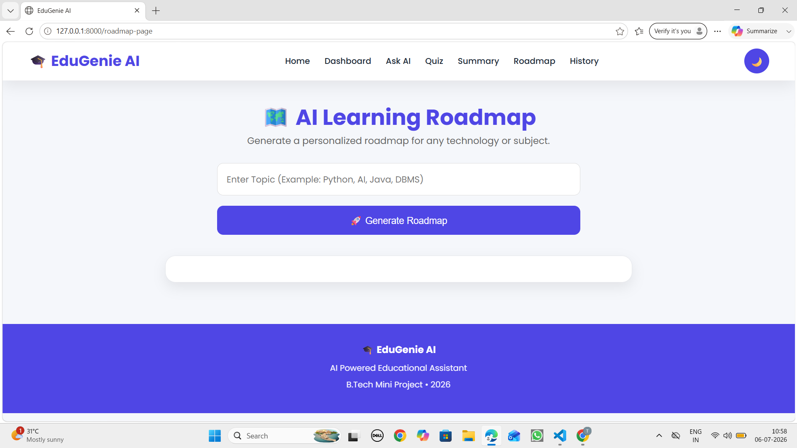
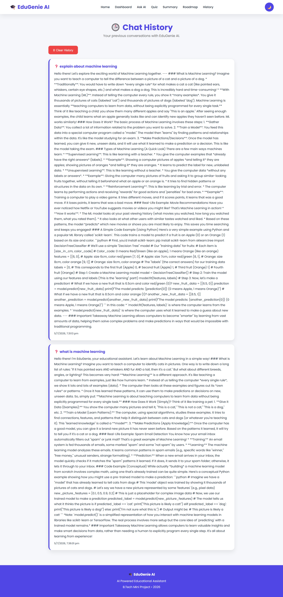
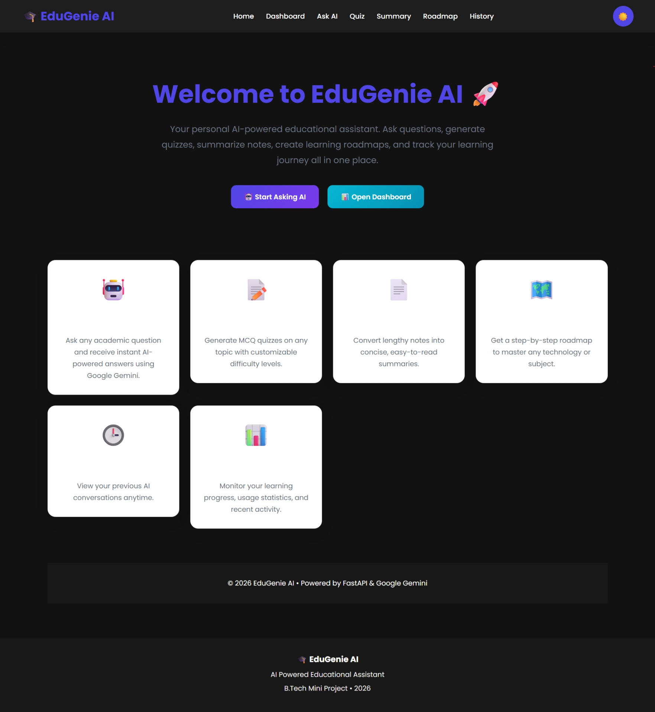

# 🎓 EduGenie AI

An AI-powered educational assistant built using **FastAPI**, **Google Gemini AI**, **HTML**, **CSS**, and **JavaScript**.

EduGenie AI helps students learn smarter by providing instant AI answers, generating quizzes, summarizing notes, creating learning roadmaps, and tracking learning progress through an interactive dashboard.

---

## 🚀 Features

### 🤖 Ask AI
- Ask educational questions
- Instant AI-powered responses using Google Gemini
- Chat interface
- Chat history

### 📝 AI Quiz Generator
- Generate quizzes on any topic
- Select difficulty level
- Choose the number of questions
- AI-generated MCQs with answers

### 📄 AI Text Summarizer
- Summarize long notes instantly
- Paste text directly
- Upload PDF files for summarization

### 🗺️ Learning Roadmap
- Generate personalized learning roadmaps
- Step-by-step guidance for any subject or technology

### 📊 Dashboard
- Questions Asked
- Quiz Count
- Summary Count
- Roadmap Count
- Recent Activity

### 🌙 Dark / Light Mode
- Toggle between Dark and Light themes
- Theme preference is saved automatically

---

# 🛠 Technologies Used

### Backend
- Python
- FastAPI
- Uvicorn

### AI
- Google Gemini API

### Frontend
- HTML5
- CSS3
- JavaScript

### Templates
- Jinja2

### PDF Processing
- PyPDF2

---
# Skills Required
- Python(Programming Language)
- FastAPI
- Generative Artificial Intelligence
- Natural Languaue Processing(NLP)
- HTML Editor
- Prompt Engineering
- HTML Appilication
- CSS Animations
- GeminiAI
- AI/ML Interface

# 📁 Project Structure

```
EduGenie/
│
├── backend/
│   ├── main.py
│   ├── gemini_service.py
│   ├── quiz.py
│   ├── summary.py
│   ├── roadmap.py
│   └── pdf_reader.py
│
├── static/
│   ├── style.css
│   ├── script.js
│   └── theme.js
│
├── templates/
│   ├── base.html
│   ├── index.html
│   ├── ask.html
│   ├── quiz.html
│   ├── summary.html
│   ├── roadmap.html
│   ├── dashboard.html
│   └── history.html
│
├── uploads/
│
├── requirements.txt
│
└── README.md
```

---

# ⚙️ Installation

Clone the repository

```bash
git clone <repository-url>
```

Create virtual environment

```bash
python -m venv venv
```

Activate virtual environment

Windows

```bash
venv\Scripts\activate
```

Install dependencies

```bash
pip install -r requirements.txt
```

Run the project

```bash
uvicorn backend.main:app --reload
```

Open browser

```
http://127.0.0.1:8000
```

---

# 📸 Screens

- Home Page

- Ask AI

- Dashboard

- Quiz Generator

- Text Summarizer

- Learning Roadmap

- Chat History

- Dark Mode

---

# Future Enhancements

- User Login & Authentication
- Database Integration
- Export Quiz to PDF
- Voice Assistant
- AI Flashcards
- Leaderboard
- Personalized Recommendations
- Multi-language Support

---

# Learning Outcomes

This project demonstrates:

- REST API Development using FastAPI
- AI Integration using Google Gemini
- Prompt Engineering
- PDF Processing
- Frontend Development
- Responsive Web Design
- Local Storage Usage
- Dashboard Design
- API Integration
- Educational AI Applications

---

# Team Members
- Pavani Lashmi Gonthina
- Nulu Tripura Raja Niharika
- Prasad Lanka
- Satwika Akula
- Seeli Nehaswapna

---

# License

This project is developed for educational purposes.